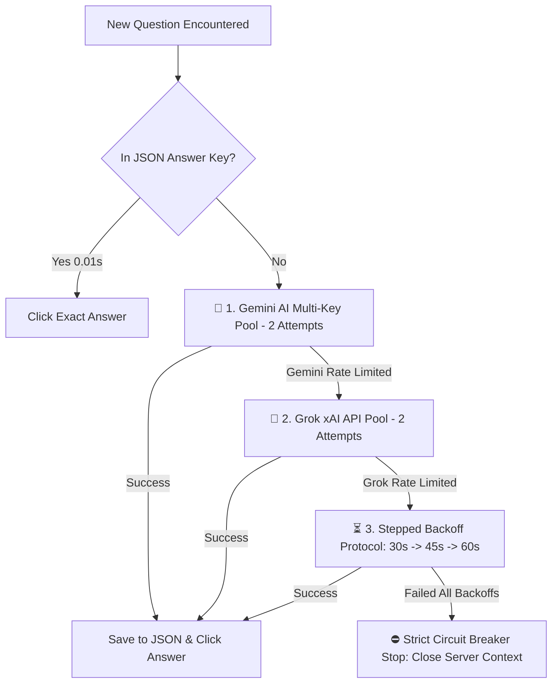

# ⚙️ MODULE EXECUTION, RETRY PROTOCOL & STEPPED BACKOFF GUIDE

This document provides a comprehensive technical reference for the **Module Execution Pipeline**, **Locked Item Recovery**, **Double Confirmation Gate Guard**, **Certificate Handling**, and the **Stepped Backoff Retry Protocol (30s ➔ 45s ➔ 60s)** in **DIKSHA+ Automation Suite**.

---

## 📑 Table of Contents

1. [Module Execution Pipeline](#1-module-execution-pipeline)
2. [Locked Item Session Recovery](#2-locked-item-session-recovery)
3. [Double Confirmation & Gate Refresh](#3-double-confirmation--gate-refresh)
4. [Certificate Section Handling](#4-certificate-section-handling)
5. [Circuit Breaker Guard](#5-circuit-breaker-guard)
6. [Stepped Backoff Retry Protocol (30s ➔ 45s ➔ 60s)](#6-stepped-backoff-retry-protocol-30s--45s--60s)
7. [Continuous Execution Fallback](#7-continuous-execution-fallback)

---

## 1. Module Execution Pipeline

DIKSHA+ executes course modules sequentially from Module #1 to Module #N with strict validation at every level:

```text
[STEP 01] Navigate & Expand Module Header
  └── [STEP 02] Check if Module is 100% Completed (Skip if Done)
        └── [STEP 03] Execute Subsection Items (Videos, PDFs, H5P, Quizzes, Feedback)
              └── [STEP 04] Double Confirmation Gate Check
                    └── [STEP 05] Advance to Next Module
```

* **Item Attempts Tracking**: Tracks execution attempts per subsection item using `item_attempts[btn_text]`.
* **Automatic Activity Selection**: Dynamically detects activity type (`url`, `resource`, `h5pactivity`, `quiz`, `feedback`) and dispatches the correct dedicated automation engine.

---

## 2. Locked Item Session Recovery

When DIKSHA server locks a subsection item because a prerequisite video or lesson is processing:

1. **Detection**: `is_button_enabled(btn) == False`.
2. **Log Notice**:
   ```text
   --> [LOCKED ITEM] Subsection [02/05]: 'Activity 02' is currently LOCKED.
   --> [SERVER REFRESH] Waiting 5s gap & reloading page (page.reload()) to fetch updated DIKSHA server session unlock status...
   ```
3. **Session Refresh**: Waits 5 seconds, executes `page.reload()`, waits 5 seconds for backend unlock sync, and re-opens the active module accordion.

---

## 3. Double Confirmation & Gate Refresh

After completing all subsection activities in a module, DIKSHA+ verifies completion:

* **Check 1**: Re-scans all individual item checkmarks in the DOM (`is_item_100_percent_complete()`).
* **Check 2**: Re-scans the main module header percentage badge (`is_header_100_percent_complete()`).
* **Backend Sync Refresh**: If the badge is not 100% yet due to DIKSHA server latency:
  ```text
  --> [GATE REFRESH] Reloading page once to sync DIKSHA server backend checkmarks...
  ```
  Executes `page.reload()` once and re-checks completion before advancing.

---

## 4. Certificate Section Handling

Post-course reward download pages (`'Certificate'`, `'Download Certificate'`):

* **Automatic Skip**: Recognized as optional reward download links rather than interactive lesson activities.
* **Clean Log**:
  ```text
  🎓 [CERTIFICATE SECTION] 'Certificate' reached end of course. Course completed successfully!
  ```
* **No Error Thrown**: Finishes execution cleanly without triggering server stuck errors.

---

## 5. Circuit Breaker Guard

If after 4 attempts and page reloads a regular course lesson or assessment remains incomplete:

* **Trigger Notice**:
  ```text
  ❌ [CRITICAL DIKSHA SERVER FAILURE] 'Module Title' remains incomplete after 4 attempts & 5s page reloads.
  ⛔ [CIRCUIT BREAKER TRIGGERED] Stopping all automation processes and closing server context!
  ```
* **Safety Protocol**: Closes browser context cleanly (`page.context.close()`) to prevent infinite loops and protect your account.

---

## 6. Dual AI Solver & Stepped Backoff Retry Protocol (30s ➔ 45s ➔ 60s)

When solving new quiz or feedback questions live via AI:



### ⏳ AI Execution Priority Table:

| Priority | AI Engine | Attempt Limit | Action |
| :--- | :--- | :--- | :--- |
| **1. Primary** | **Google Gemini AI API** | **2 Attempts** | Rotates across encrypted Gemini key pool & models (`gemini-2.0-flash`, `gemini-flash-latest`). |
| **2. Fallback** | **xAI Grok API** (`console.x.ai`) | **2 Attempts** | Rotates across encrypted Grok key pool & models (`grok-4.3`, `grok-2-1212`, `grok-beta`). |
| **3. Backoff #1** | Both Gemini & Grok | **Wait 30s** | Waits 30 seconds for quota reset $\rightarrow$ Retries all keys. |
| **4. Backoff #2** | Both Gemini & Grok | **Wait 45s** | Waits 45 seconds for quota reset $\rightarrow$ Retries all keys. |
| **5. Backoff #3** | Both Gemini & Grok | **Wait 60s** | Waits 60 seconds for quota reset $\rightarrow$ Retries all keys. |
| **6. Final Action**| **Circuit Breaker** | **STOP & CLOSE** | **Never uses dummy Option A!** Closes browser context (`page.context.close()`) to protect 100% accuracy. |

