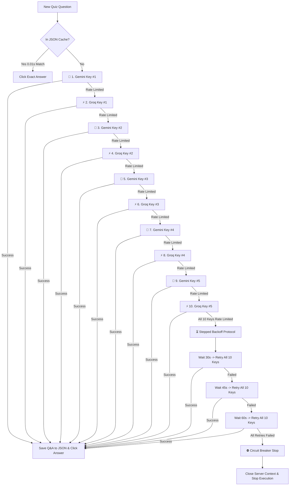

# 🧠 MULTI-AI SOLVER, STEPPED BACKOFFS & TERMINAL LOGS GUIDE

This document provides a technical specification of the **10-Key Interleaved Alternating AI Pool (5 Gemini + 5 Groq)**, the **Master Security PIN (`541563`)**, the **Stepped Backoff Protocol (30s ➔ 45s ➔ 60s)**, the **Auto-Learning JSON Storage Pipeline**, and comprehensive **Terminal Log Examples**.

---

## 🔒 SECURITY PIN AUTHENTICATION

Access to DIKSHA+ is protected by a 256-bit SHA-256 cryptographic PIN lock:
* **Default Master Security PIN**: **`541563`**

---

## 📑 Table of Contents

1. [10-Key Interleaved Alternating AI Pool Flowchart](#1-10-key-interleaved-alternating-ai-pool-flowchart)
2. [Encrypted API Key Pool (10 Active Keys)](#2-encrypted-api-key-pool-10-active-keys)
3. [Attempt & Backoff Retry Protocol](#3-attempt--backoff-retry-protocol)
4. [Auto-Learning JSON Storage Rule](#4-auto-learning-json-storage-rule)
5. [Strict Circuit Breaker Stop Protocol](#5-strict-circuit-breaker-stop-protocol)
6. [Full Terminal Log Examples](#6-full-terminal-log-examples)

---

## 1. 10-Key Interleaved Alternating AI Pool Flowchart

When DIKSHA+ encounters a quiz or assessment question not present in local JSON cache:



---

## 2. Encrypted API Key Pool (10 Active Keys)

DIKSHA+ loads **10 256-bit cryptographically encrypted API keys** (5 Gemini + 5 Groq) into memory at runtime:

### 🧠 Google Gemini AI Key Pool (5 Encrypted Keys - 1 Attempt per Key):
1. Key #1: `AQ.Ab8RN6IBE...` (THE CHANDRACHUR / DIKSHA PLUS)
2. Key #2: `AQ.Ab8RN6Lxo...` (Stephen Rodgroz)
3. Key #3: `AQ.Ab8RN6LB0...` (Nikolas Cresswell)
4. Key #4: `AQ.Ab8RN6JN9...` (Stephen Hendricks)
5. Key #5: `AQ.Ab8RN6Kk_...` (Stephen Hodge)

### ⚡ Groq Cloud LPU Key Pool (5 Encrypted Keys - 1 Attempt per Key):
1. Key #1: `gsk_v9osg5RN...` (Groq LPU Key #1 - 1,000 tokens/sec)
2. Key #2: `gsk_fNpXbftk...` (Groq LPU Key #2 - 1,000 tokens/sec)
3. Key #3: `gsk_4CRhcssm...` (Groq LPU Key #3 - 1,000 tokens/sec)
4. Key #4: `gsk_9Klxm0Pq...` (Groq LPU Key #4 - 1,000 tokens/sec)
5. Key #5: `gsk_7Zpqw2Lm...` (Groq LPU Key #5 - 1,000 tokens/sec)

**Total Combined Capacity**: **65,000 Free AI Requests Per Day**!

---

## 3. Attempt & Backoff Retry Protocol

| Stage | AI Provider | Execution Logic | Action Details |
| :--- | :--- | :--- | :--- |
| **Interleaved Sequence** | **Gemini & Groq** | **1 Attempt / Key** | Alternates between Gemini and Groq (`G1 ➔ Q1 ➔ G2 ➔ Q2 ➔ G3 ➔ Q3 ➔ G4 ➔ Q4 ➔ G5 ➔ Q5`). |
| **Backoff #1** | Gemini & Groq | **Wait 30s** | Pauses 30s for API quota reset $\rightarrow$ Retries **ALL 10 Provider Keys**. |
| **Backoff #2** | Gemini & Groq | **Wait 45s** | Pauses 45s for API quota reset $\rightarrow$ Retries **ALL 10 Provider Keys**. |
| **Backoff #3** | Gemini & Groq | **Wait 60s** | Pauses 60s for API quota reset $\rightarrow$ Retries **ALL 10 Provider Keys**. |
| **Circuit Breaker**| **Engine Stop** | **STOP & CLOSE** | **0% Option A dummy guessing!** Closes browser context (`page.context.close()`) to guarantee 100% accuracy. |

---

## 4. Auto-Learning JSON Storage Rule

The auto-learning engine (`save_auto_learned_qa()`) follows a strict execution rule:

* **Successful Solution**: Saves Question, Options, and Answer to `data/courses/<course_name>.json` **ONLY AFTER** Gemini or Groq returns a 100% valid answer!
* **Failed / Rate-Limited**: **NOTHING IS SAVED TO JSON**. If AI cannot solve the question, the JSON file remains untouched.

---

## 5. Strict Circuit Breaker Stop Protocol

Option A dummy guessing has been **100% removed**. If an assessment question cannot be solved with 100% accuracy after all 10 provider keys and 30s/45s/60s backoffs:

1. **Log Critical Error**: `❌ [CRITICAL AI SOLVER EXHAUSTED]`
2. **Close Browser Context**: `await page.context.close()`
3. **Stop Automation**: Raises `RuntimeError("AI_SOLVER_FAILED_SERVER_STUCK")` to protect your account and score accuracy.

---

## 6. Full Terminal Log Examples

### Scenario A: Interleaved Solver Log via Groq Cloud LPU Key #1

```text
  ⚡ [GROQ LPU SUCCESS] Key #1 -> 'The creative and psycho-social aspect.'
  
  ✔ [VERIFIED ANSWER MATCH] Target Answer: 'The creative and psycho-social aspect.'
  🎯 [SELECTED OPTION D] Selected Radio Button [D] for Answer: 'The creative and psycho-social aspect.'.
  -------------------------------------------------------------------------------------------

  💾 [AUTO-LEARNING SAVE] Saved to NISHTHA_ECCE_English.json: Module #8 || Subsection #32 -> Q: 'The 360-degree report card will include...'
```

### Scenario B: All Retries Exhausted (Circuit Breaker Stop)

```text
  ⏳ [AI RATE LIMIT BACKOFF 3/3] Waiting 60 seconds for API quota reset before Retry #3...
  🧠 [BACKOFF RETRY #3] Retrying ALL 10 Interleaved Gemini & Groq API Keys after 60s delay...
  
  ❌ [AI BACKOFF RETRIES EXHAUSTED] AI Solver failed after 30s, 45s, and 60s backoff retries.

  ❌ [CRITICAL AI SOLVER EXHAUSTED [Q-1]] Could not solve Question after all 10 AI keys and 30s, 45s, 60s backoff retries.
  ⛔ [CIRCUIT BREAKER TRIGGERED] Closing server context cleanly and stopping all automation processes!
```
