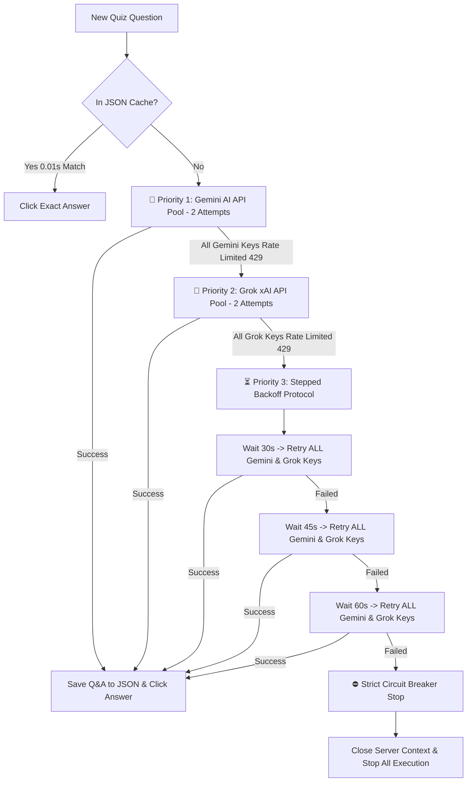

# 🧠 DUAL AI SOLVER, STEPPED BACKOFFS & TERMINAL LOGS GUIDE

This document provides a technical specification of the **Dual AI Solver Architecture (Gemini AI + Grok xAI)**, the **Stepped Backoff Protocol (30s ➔ 45s ➔ 60s)**, the **Auto-Learning JSON Storage Pipeline**, and comprehensive **Terminal Log Examples**.

---

## 📑 Table of Contents

1. [Dual AI Solver Execution Hierarchy](#1-dual-ai-solver-execution-hierarchy)
2. [Attempt & Backoff Retry Protocol](#2-attempt--backoff-retry-protocol)
3. [Auto-Learning JSON Storage Rule](#3-auto-learning-json-storage-rule)
4. [Strict Circuit Breaker Stop Protocol](#4-strict-circuit-breaker-stop-protocol)
5. [Full Terminal Log Examples](#5-full-terminal-log-examples)

---

## 1. Dual AI Solver Execution Hierarchy

When DIKSHA+ encounters a quiz or assessment question:



---

## 2. Attempt & Backoff Retry Protocol

| Stage | AI Engine | Attempt Limit | Action Details |
| :--- | :--- | :--- | :--- |
| **Priority 1** | **Google Gemini AI** | **2 Attempts** | Rotates across encrypted Gemini key pool & models (`gemini-2.0-flash`, `gemini-flash-latest`). |
| **Priority 2** | **xAI Grok API** (`console.x.ai`) | **2 Attempts** | Rotates across encrypted Grok key pool & models (`grok-4.3`, `grok-2-1212`, `grok-beta`). |
| **Backoff #1** | Both Gemini & Grok | **Wait 30s** | Pauses 30s for API quota reset $\rightarrow$ Retries **ALL** Gemini & Grok keys. |
| **Backoff #2** | Both Gemini & Grok | **Wait 45s** | Pauses 45s for API quota reset $\rightarrow$ Retries **ALL** Gemini & Grok keys. |
| **Backoff #3** | Both Gemini & Grok | **Wait 60s** | Pauses 60s for API quota reset $\rightarrow$ Retries **ALL** Gemini & Grok keys. |
| **Circuit Breaker**| **Engine Stop** | **STOP & CLOSE** | **Never uses dummy Option A!** Closes browser context (`page.context.close()`) to guarantee 100% accuracy. |

---

## 3. Auto-Learning JSON Storage Rule

The auto-learning engine (`save_auto_learned_qa()`) follows a strict execution rule:

* **Successful Solution**: Saves Question, Options, and Answer to [`data/courses/<course_name>.json`](file:///C:/Users/thego/.gemini/antigravity/scratch/Diksha+%20Automation%20Suite/data/courses/) **ONLY AFTER** Gemini or Grok returns a 100% valid answer!
* **Failed / Rate-Limited**: **NOTHING IS SAVED TO JSON**. If AI cannot solve the question, the JSON file remains untouched.

---

## 4. Strict Circuit Breaker Stop Protocol

Option A dummy guessing has been **100% removed**. If an assessment question cannot be solved with 100% accuracy after all 2 Gemini attempts, 2 Grok attempts, and 30s/45s/60s backoffs:

1. **Log Critical Error**: `❌ [CRITICAL AI SOLVER EXHAUSTED]`
2. **Close Browser Context**: `await page.context.close()`
3. **Stop Automation**: Raises `RuntimeError("AI_SOLVER_FAILED_SERVER_STUCK")` to protect your account and score accuracy.

---

## 5. Full Terminal Log Examples

### Scenario A: Successful Solve via Backoff #2 (45s)

```text
===================================================================================================
  ❓ [Q-1 FULL QUESTION]: What is the primary objective of Action Research in classroom teaching?
===================================================================================================
  🧠 [GEMINI AI ATTEMPT 1/2] Requesting solution via Gemini API...
  ⏳ [GEMINI RATE LIMIT] Key #1 rate limited. Trying next key...
  ⏳ [GEMINI RATE LIMIT] Key #2 rate limited. Trying next key...

  🧠 [GEMINI AI ATTEMPT 2/2] Requesting solution via Gemini API...
  ⏳ [GEMINI RATE LIMIT] Key #1 rate limited. Trying next key...

  🤖 [GROK AI ATTEMPT 1/2] Gemini keys exhausted. Requesting solution via Grok xAI API...
  ⚠️ [GROK AI NOTICE] (grok-4.3 Key #1): HTTP Error 429: Too Many Requests
  
  🤖 [GROK AI ATTEMPT 2/2] Gemini keys exhausted. Requesting solution via Grok xAI API...
  ⚠️ [GROK AI NOTICE] (grok-4.3 Key #1): HTTP Error 429: Too Many Requests

  ⚠️ [AI INITIAL ATTEMPTS EXHAUSTED] Entering Stepped Backoff Retry Protocol (30s -> 45s -> 60s)...

  ⏳ [AI RATE LIMIT BACKOFF 1/3] Waiting 30 seconds for API quota reset before Retry #1...
  🧠 [BACKOFF RETRY #1] Retrying ALL Gemini API Keys after 30s delay...
  🤖 [BACKOFF RETRY #1] Retrying ALL Grok xAI API Keys after 30s delay...

  ⏳ [AI RATE LIMIT BACKOFF 2/3] Waiting 45 seconds for API quota reset before Retry #2...
  🧠 [BACKOFF RETRY #2] Retrying ALL Gemini API Keys after 45s delay...
  🧠 [AI BACKOFF SUCCESS] Solved on Backoff #2 (45s) via Gemini (gemini-2.0-flash) Key #1 -> 'To solve immediate practical problems in classroom'
  
  ⚡ [VERIFIED ANSWER MATCH [Q-1]] Target Answer: 'To solve immediate practical problems in classroom'
  🎯 [SELECTED OPTION B] Selected Radio Button [B] for Answer: 'To solve immediate practical problems in classroom'.
  -------------------------------------------------------------------------------------------

  💾 [AUTO-LEARNING SAVE] Saved to কাৰ্যভিত্তিক_গৱেষণা_(Action_Research).json: Module #3 ('মডিউল ২') || Subsection #1 ('Assessment') -> Q: 'What is the primary objective of Action Research...'
```

### Scenario B: All Retries Exhausted (Circuit Breaker Stop)

```text
  ⏳ [AI RATE LIMIT BACKOFF 3/3] Waiting 60 seconds for API quota reset before Retry #3...
  🧠 [BACKOFF RETRY #3] Retrying ALL Gemini API Keys after 60s delay...
  🤖 [BACKOFF RETRY #3] Retrying ALL Grok xAI API Keys after 60s delay...
  
  ❌ [AI BACKOFF RETRIES EXHAUSTED] AI Solver failed after 30s, 45s, and 60s backoff retries.

  ❌ [CRITICAL AI SOLVER EXHAUSTED [Q-1]] Could not solve Question 'What is the primary objective of Action Research...' after 2 Gemini attempts, 2 Grok attempts, and 30s, 45s, 60s backoff retries.
  ⛔ [CIRCUIT BREAKER TRIGGERED] Closing server context cleanly and stopping all automation processes!
```
