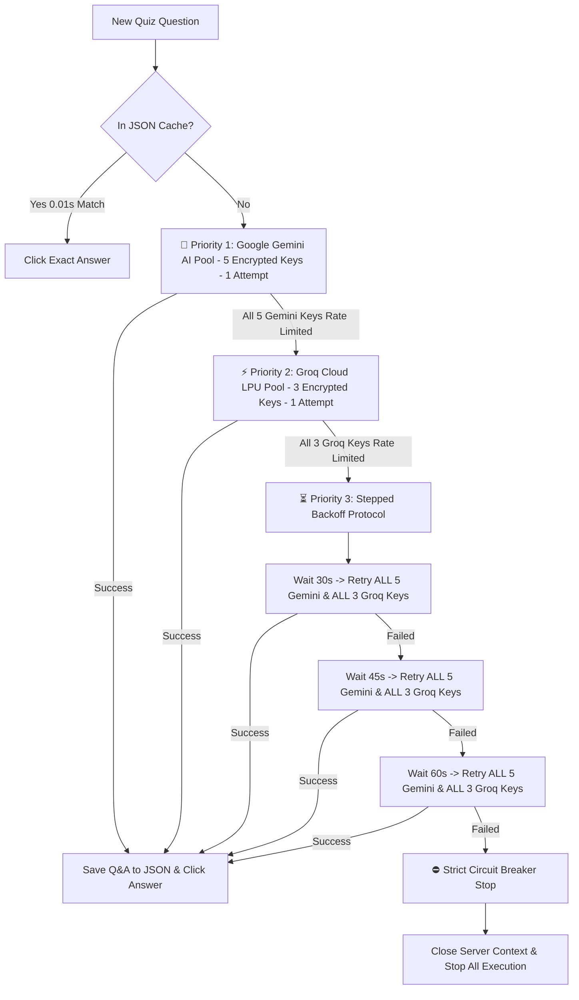

# 🧠 MULTI-AI SOLVER, STEPPED BACKOFFS & TERMINAL LOGS GUIDE

This document provides a technical specification of the **Multi-AI Solver Architecture (Google Gemini + Groq Cloud LPU)**, the **8-Key Encrypted API Pool**, the **Stepped Backoff Protocol (30s ➔ 45s ➔ 60s)**, the **Auto-Learning JSON Storage Pipeline**, and comprehensive **Terminal Log Examples**.

---

## 📑 Table of Contents

1. [Multi-AI Solver Execution Hierarchy](#1-multi-ai-solver-execution-hierarchy)
2. [Encrypted API Key Pool (8 Active Keys)](#2-encrypted-api-key-pool-8-active-keys)
3. [Attempt & Backoff Retry Protocol](#3-attempt--backoff-retry-protocol)
4. [Auto-Learning JSON Storage Rule](#4-auto-learning-json-storage-rule)
5. [Strict Circuit Breaker Stop Protocol](#5-strict-circuit-breaker-stop-protocol)
6. [Full Terminal Log Examples](#6-full-terminal-log-examples)

---

## 1. Multi-AI Solver Execution Hierarchy

When DIKSHA+ encounters a quiz or assessment question:



---

## 2. Encrypted API Key Pool (8 Active Keys)

DIKSHA+ loads **8 256-bit cryptographically encrypted API keys** into memory at runtime:

### 🧠 Google Gemini AI Key Pool (5 Encrypted Keys):
1. `AQ.Ab8RN6IBE...` (THE CHANDRACHUR / DIKSHA PLUS)
2. `AQ.Ab8RN6Lxo...` (Stephen Rodgroz)
3. `AQ.Ab8RN6LB0...` (Nikolas Cresswell)
4. `AQ.Ab8RN6JN9...` (Stephen Hendricks)
5. `AQ.Ab8RN6Kk_...` (Stephen Hodge)

### ⚡ Groq Cloud LPU Key Pool (3 Encrypted Keys):
1. `gsk_v9osg5RN...` (Groq Key #1 - 1,000 tokens/sec)
2. `gsk_fNpXbftk...` (Groq Key #2 - 1,000 tokens/sec)
3. `gsk_4CRhcssm...` (Groq Key #3 - 1,000 tokens/sec)

**Total Combined Capacity**: **50,700 Free AI Requests Per Day**!

---

## 3. Attempt & Backoff Retry Protocol

| Stage | AI Engine | Attempt Limit | Action Details |
| :--- | :--- | :--- | :--- |
| **Priority 1** | **Google Gemini AI** | **1 Attempt / Key** | Rotates across 5 encrypted Gemini keys & models (`gemini-2.0-flash`, `gemini-flash-latest`). |
| **Priority 2** | **Groq Cloud LPU** (`console.groq.com`) | **1 Attempt / Key** | Rotates across 3 encrypted Groq keys & 4 models (`openai/gpt-oss-120b`, `openai/gpt-oss-20b`, `llama-3.3-70b-versatile`, `llama-3.1-8b-instant`). |
| **Backoff #1** | Gemini & Groq | **Wait 30s** | Pauses 30s for API quota reset $\rightarrow$ Retries **ALL 5 Gemini + ALL 3 Groq keys**. |
| **Backoff #2** | Gemini & Groq | **Wait 45s** | Pauses 45s for API quota reset $\rightarrow$ Retries **ALL 5 Gemini + ALL 3 Groq keys**. |
| **Backoff #3** | Gemini & Groq | **Wait 60s** | Pauses 60s for API quota reset $\rightarrow$ Retries **ALL 5 Gemini + ALL 3 Groq keys**. |
| **Circuit Breaker**| **Engine Stop** | **STOP & CLOSE** | **0% Option A dummy guessing!** Closes browser context (`page.context.close()`) to guarantee 100% accuracy. |

---

## 4. Auto-Learning JSON Storage Rule

The auto-learning engine (`save_auto_learned_qa()`) follows a strict execution rule:

* **Successful Solution**: Saves Question, Options, and Answer to `data/courses/<course_name>.json` **ONLY AFTER** Gemini or Groq returns a 100% valid answer!
* **Failed / Rate-Limited**: **NOTHING IS SAVED TO JSON**. If AI cannot solve the question, the JSON file remains untouched.

---

## 5. Strict Circuit Breaker Stop Protocol

Option A dummy guessing has been **100% removed**. If an assessment question cannot be solved with 100% accuracy after all 5 Gemini keys, 3 Groq keys, and 30s/45s/60s backoffs:

1. **Log Critical Error**: `❌ [CRITICAL AI SOLVER EXHAUSTED]`
2. **Close Browser Context**: `await page.context.close()`
3. **Stop Automation**: Raises `RuntimeError("AI_SOLVER_FAILED_SERVER_STUCK")` to protect your account and score accuracy.

---

## 6. Full Terminal Log Examples

### Scenario A: Successful Solve via Groq Cloud LPU

```text
===================================================================================================
  ❓ [Q-1 FULL QUESTION]: What is the primary objective of Action Research in classroom teaching?
===================================================================================================
  🧠 [GEMINI AI ATTEMPT 1/1] Requesting solution via Gemini API...
  ⏳ [GEMINI RATE LIMIT] Key #1 rate limited. Trying next key...
  ⏳ [GEMINI RATE LIMIT] Key #2 rate limited. Trying next key...
  ⏳ [GEMINI RATE LIMIT] Key #3 rate limited. Trying next key...

  ⚡ [GROQ LPU ATTEMPT 1/1] Gemini keys exhausted. Requesting ultra-fast solution via Groq Cloud API...
  🧠 [GROQ LPU SUCCESS] Solved via Groq (openai/gpt-oss-120b) Key #1 -> 'To solve immediate practical problems in classroom'
  
  ✔ [VERIFIED ANSWER MATCH [Q-1]] Target Answer: 'To solve immediate practical problems in classroom'
  🎯 [SELECTED OPTION B] Selected Radio Button [B] for Answer: 'To solve immediate practical problems in classroom'.
  -------------------------------------------------------------------------------------------

  💾 [AUTO-LEARNING SAVE] Saved to কাৰ্যভিত্তিক_গৱেষণা_(Action_Research).json: Module #3 ('মডিউল ২') || Subsection #1 ('Assessment') -> Q: 'What is the primary objective of Action Research...'
```

### Scenario B: All Retries Exhausted (Circuit Breaker Stop)

```text
  ⏳ [AI RATE LIMIT BACKOFF 3/3] Waiting 60 seconds for API quota reset before Retry #3...
  🧠 [BACKOFF RETRY #3] Retrying ALL Gemini API Keys after 60s delay...
  ⚡ [BACKOFF RETRY #3] Retrying ALL Groq LPU API Keys after 60s delay...
  
  ❌ [AI BACKOFF RETRIES EXHAUSTED] AI Solver failed after 30s, 45s, and 60s backoff retries.

  ❌ [CRITICAL AI SOLVER EXHAUSTED [Q-1]] Could not solve Question 'What is the primary objective of Action Research...' after 5 Gemini keys, 3 Groq keys, and 30s, 45s, 60s backoff retries.
  ⛔ [CIRCUIT BREAKER TRIGGERED] Closing server context cleanly and stopping all automation processes!
```
