# ⚡ DIKSHA+ Automation Suite — Complete Workflow Documentation

> **Version:** Post-Fix (33 Bugs Resolved) | **Engine:** `diksha_plus_engine.py` | **Entry:** `main.py`

---

## 📋 Table of Contents

1. [System Architecture](#1-system-architecture)
2. [Startup & Security Flow](#2-startup--security-flow)
3. [Login Flow](#3-login-flow)
4. [Course Selection Flow](#4-course-selection-flow)
5. [Module Processing Engine](#5-module-processing-engine)
6. [Per-Subsection 3-Attempt Retry System](#6-per-subsection-3-attempt-retry-system)
7. [Course Restart System (5 Restarts)](#7-course-restart-system-5-restarts)
8. [Video Activity Flow](#8-video-activity-flow)
9. [PDF Activity Flow](#9-pdf-activity-flow)
10. [Quiz / Assessment Flow](#10-quiz--assessment-flow)
11. [Feedback Activity Flow](#11-feedback-activity-flow)
12. [H5P Interactive Activity Flow](#12-h5p-interactive-activity-flow)
13. [Locked Item Handler](#13-locked-item-handler)
14. [AI Solver System](#14-ai-solver-system)
15. [Double Confirmation & Module Sync](#15-double-confirmation--module-sync)
16. [Key Timings Reference](#16-key-timings-reference)

---

## 1. System Architecture

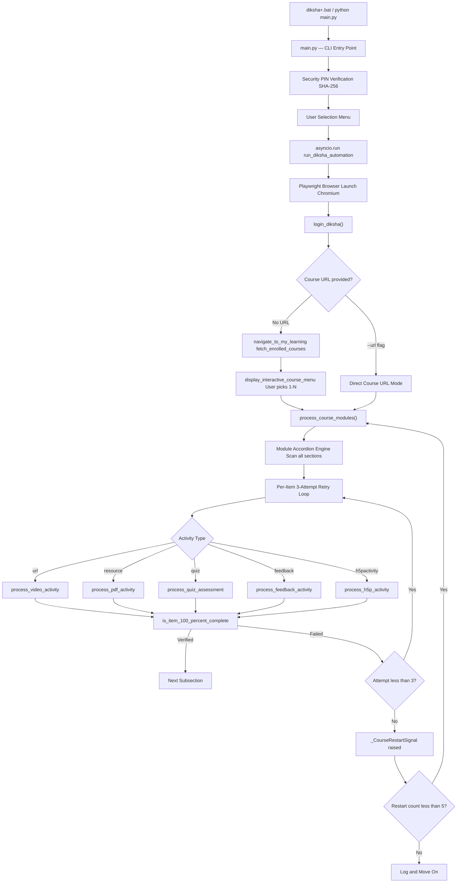

---

## 2. Startup & Security Flow

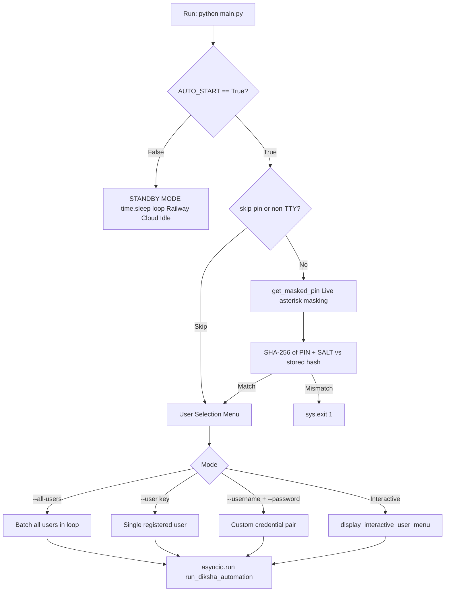

### Example Log — Startup
```
===================================================================
 ⚡ DIKSHA+ AUTOMATION SUITE
===================================================================
[Login] Registered accounts:
  [1] Sumanta Halder           : 7044015007
  [2] Sujata Mondal            : 8617383566
  [3] Tasapur Rahaman          : 7908555852
-------------------------------------------------------------------
[Security] Enter 6-digit Security PIN to unlock: ******
✅ Security PIN verified. Access granted.
```

---

## 3. Login Flow

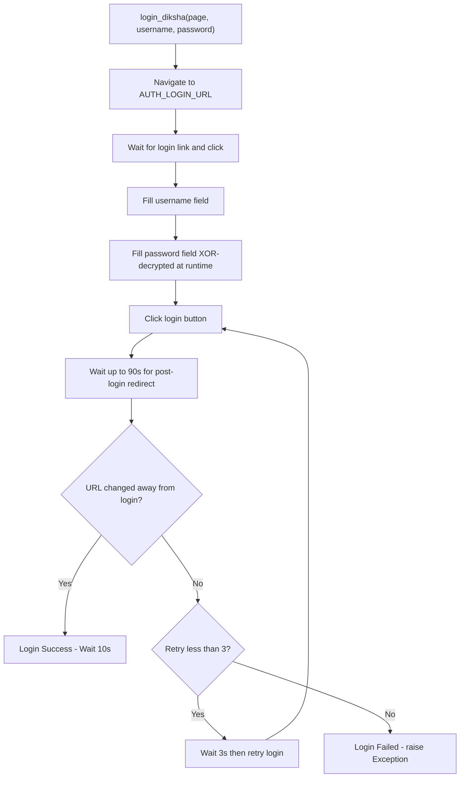

### Example Log — Login
```
[12:05:58] INFO  [LOGIN] Navigating to DIKSHA login page...
[12:06:01] INFO    --> Entering credentials for: Sumanta Halder (7044015007)
[12:06:03] INFO    --> Clicking LOGIN button...
[12:06:09] INFO    --> ✅ Login successful! Redirected to dashboard.
[12:06:09] INFO    --> Waiting 10s for dashboard to fully load...
```

---

## 4. Course Selection Flow

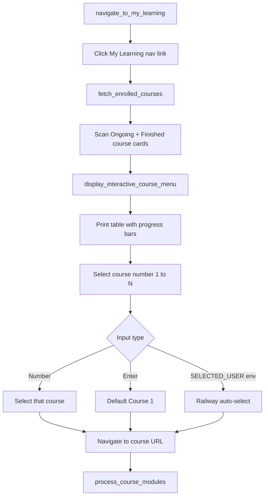

### Example Log — Course Menu
```
===================================================================
  🎓 DIKSHA+ ENROLLED COURSES (1 ONGOING • 2 FINISHED)
===================================================================

 ⚡ ONGOING COURSES:
  [01] NISHTHA ECCE English           [████░░░░░░  40%] ⌛ Ongoing

 ✨ FINISHED COURSES:
  [02] Power of Audio in Education    [██████████ 100%] 🏆 Finished
  [03] NISHTHA FLN English            [██████████ 100%] 🏆 Finished

-------------------------------------------------------------------
 👉 Select course number to automate (1-3) [Enter for 1]: 1

[12:06:12] INFO  🚀 Starting Enrolled Course: [1] NISHTHA ECCE English
[12:06:12] INFO    --> Loaded answer key: data/courses/NISHTHA_ECCE_English.json
```

---

## 5. Module Processing Engine

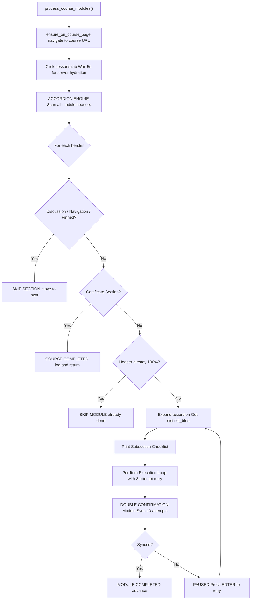

### Example Log — Module Scan
```
[12:06:19] INFO  [ACCORDION ENGINE] Scanning course section accordions...
[12:06:19] INFO    --> [SKIP SECTION] 'Important Discussions (Pinned)' Skipping!
[12:06:19] INFO    --> [SKIP SECTION] 'Course Navigation' Skipping!

===================================
   DIKSHA COURSE STRUCTURE (6 MODULES DETECTED)
===================================
  [01] ⏳ Module 01: Introduction to ECCE      || 0%   || View
  [02] ✓  Module 02: Play and Development       || 100% || View
  [03] ⏳ Module 03: Play-based Activities      || 40%  || View

  📋 [SUBSECTION BREAKDOWN (31 ITEMS)]:
     [01/31] ✓  Introduction to ECCE            || 100% || View
     [08/31] ⏳ Use of Play-based Activities     || 0%   || View
     [13/31] ⏳ Play and Learning Material       || 0%   || View
```

---

## 6. Per-Subsection 3-Attempt Retry System

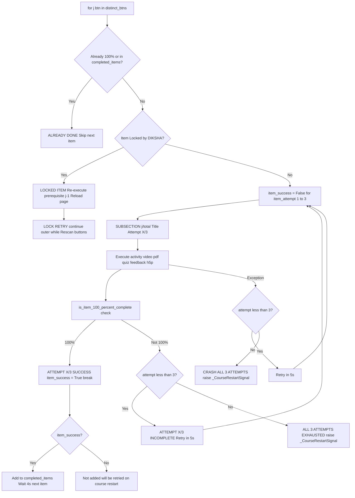

### Example Log — Attempt 1 Success
```
===================================
 ▶ SUBSECTION [08/31]: 'Use of Play-based Activities' (Type: 'url') [Attempt 1/3]
===================================
[12:06:47] INFO    --> [CLICKED VIEW BUTTON] View button click sent — waiting 3s...
[12:06:50] INFO    --> [MODAL OPENED] Activity modal opened successfully on first click!
[12:06:57] INFO    --> Video playback started (Muted & 360p Low Resolution).
[12:06:59] INFO    --> Video Duration: 192 seconds (3m 12s)
[12:07:14] INFO    --> Dynamic Acceleration: Applying 10x Speed (Short Video < 5 min)...
[12:08:04] INFO    --> Clicking activity close button (x)...
[12:08:08] INFO    --> Server 100% checkmark confirmed!
[12:08:08] INFO  ✅ [ATTEMPT 1/3 SUCCESS] 'Use of Play-based Activities' verified 100% complete!
[12:08:08] INFO    --> DIKSHA Server sync buffer: waiting 4 seconds...
```

### Example Log — Attempt 1 Fail → Attempt 2 Success
```
===================================
 ▶ SUBSECTION [08/31]: 'Use of Play-based Activities' (Type: 'url') [Attempt 1/3]
===================================
[12:06:57] ERROR    [-] Attempt 1/3 execution notice: TimeoutError waiting for selector
[12:06:57] INFO    --> Retrying in 5s... (Attempt 2/3)

===================================
 ▶ SUBSECTION [08/31]: 'Use of Play-based Activities' (Type: 'url') [Attempt 2/3]
===================================
[12:07:05] INFO    --> Video Duration: 192 seconds
[12:07:58] INFO    --> Server 100% checkmark confirmed!
[12:07:58] INFO  ✅ [ATTEMPT 2/3 SUCCESS] Verified 100% complete!
```

### Example Log — All 3 Attempts Exhausted
```
===================================
 ▶ SUBSECTION [13/31]: 'Play and Learning Material' (Type: 'resource') [Attempt 3/3]
===================================
[12:15:30] WARNING   ⚠️ [ATTEMPT 3/3 INCOMPLETE] Not yet 100% on server.
[12:15:30] WARNING   ⚠️ [ALL 3 ATTEMPTS EXHAUSTED] 'Play and Learning Material' failed all 3 attempts.
                         Restarting course from beginning...
```

---

## 7. Course Restart System (5 Restarts)

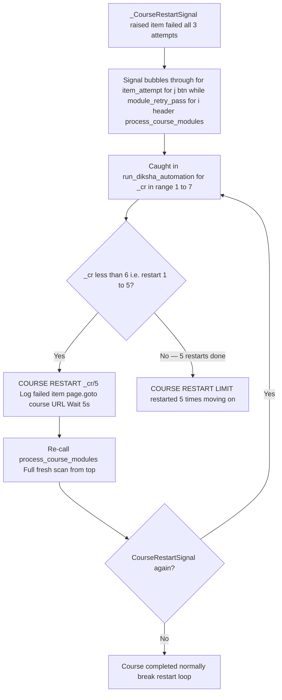

### Example Log — Course Restart 1/5
```
[12:15:44] WARNING  ⚠️ [ALL 3 ATTEMPTS EXHAUSTED] 'Play and Learning Material' failed.
                        Restarting course from beginning...

===================================================================
 🔄 [COURSE RESTART 1/5] Item 'Play and Learning Material' failed all attempts.
     Restarting course from beginning...
===================================================================

[12:15:49] INFO  [COURSE MODULES] Checking for 'Lessons' tab...
[12:15:50] INFO    --> Waiting 5 seconds for DIKSHA server to hydrate modules...
[12:15:55] INFO  [ACCORDION ENGINE] Scanning course section accordions...
[12:15:55] INFO    --> [SKIP MODULE] 'Module 01' is ALREADY 100% COMPLETED. Skipping!
[12:15:55] INFO    --> [SKIP MODULE] 'Module 02' is ALREADY 100% COMPLETED. Skipping!

===================================
 ▶ SUBSECTION [13/31]: 'Play and Learning Material' (Type: 'resource') [Attempt 1/3]
===================================
[12:16:12] INFO  ✅ [ATTEMPT 1/3 SUCCESS] 'Play and Learning Material' verified 100% complete!
```

### Example Log — Restart Limit Hit
```
[12:45:00] ERROR  ❌ [COURSE RESTART LIMIT] Course restarted 5 times.
                     Item 'Play and Learning Material' still failing. Moving on.
```

---

## 8. Video Activity Flow

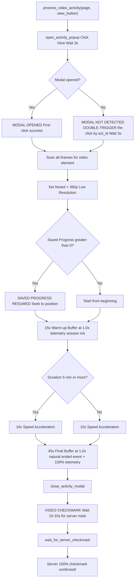

### Example Log — Video
```
[12:06:46] INFO  [VIDEO ACTIVITY] Opening video module...
[12:06:47] INFO    --> [CLICKED VIEW BUTTON] View button click sent — waiting 3s...
[12:06:50] INFO    --> [MODAL OPENED] Activity modal opened successfully on first click!
[12:06:57] INFO    --> Video playback started (Muted & 360p Low Resolution preference set).
[12:06:59] INFO    --> Video Duration: 192 seconds (3m 12s)
[12:06:59] INFO    --> [SAVED PROGRESS RESUMED] Video already at 2% (5s / 192s)!
[12:06:59] INFO    --> 15s Warm-up Buffer: playing at 1.0x speed for session telemetry...
[12:07:14] INFO    --> Dynamic Acceleration: Applying 10x Speed (Short Video < 5 min)...
[12:07:29] INFO    --> 45s Final Buffer: slowing to 1.0x speed for natural ended event...
[12:08:04] INFO    --> Clicking activity close button (x)...
[12:08:08] INFO    --> [VIDEO CHECKMARK] Waiting 10s to 15s for video 100% checkmark...
[12:08:08] INFO    --> Server 100% checkmark confirmed!
```

### Example Log — Double-Trigger Popup
```
[12:06:47] INFO    --> [CLICKED VIEW BUTTON] View button click sent — waiting 3s...
[12:06:50] WARNING   --> [MODAL NOT DETECTED] Modal did not open after first click.
                         Attempting double-trigger fallback...
[12:06:50] INFO    --> [DOUBLE-TRIGGER POPUP] Re-clicking title link to force open popup modal...
[12:06:53] INFO    --> Video playback started (Muted & 360p Low Resolution).
```

---

## 9. PDF Activity Flow

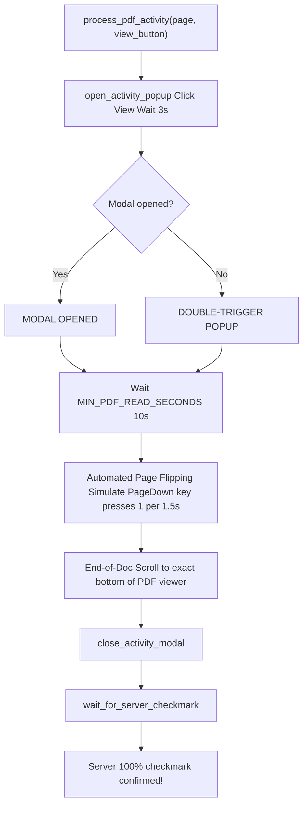

### Example Log — PDF
```
[12:08:24] INFO  [PDF ACTIVITY] Opening PDF document resource...
[12:08:27] INFO    --> [CLICKED VIEW BUTTON] View button click sent — waiting 3s...
[12:08:30] INFO    --> [MODAL OPENED] Activity modal opened successfully on first click!
[12:08:39] INFO    --> Automated Page Flipping: simulating PageDown key presses...
[12:08:51] INFO    --> End-of-Doc Scroll: scrolling PDF viewer container to exact bottom...
[12:08:55] INFO    --> Clicking activity close button (x)...
[12:08:59] INFO    --> Server 100% checkmark confirmed!
```

---

## 10. Quiz / Assessment Flow

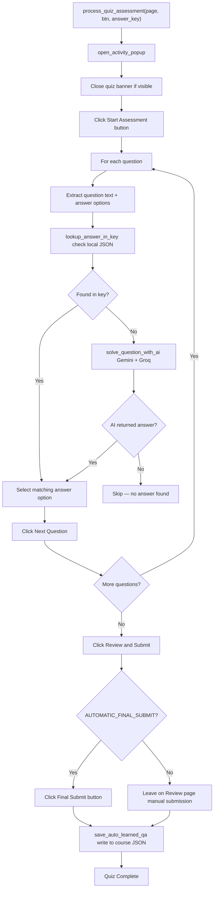

### Example Log — Quiz with AI
```
[12:20:11] INFO  [QUIZ] Question 1/10: 'What is play-based learning?'
[12:20:11] INFO    --> Checking local answer key... Not found.
[12:20:11] INFO    --> Querying AI solver (Gemini → Groq)...
[12:20:13] INFO    🧠 [GEMINI AI SUCCESS] Key #1 -> 'Child-led exploration'
[12:20:13] INFO    --> Selected option [B]: 'Child-led exploration'
[12:20:13] INFO    --> Clicking Next Question...
...
[12:20:45] INFO    --> Clicking Review & Submit...
[12:20:48] INFO    --> Clicking Final Submit button...
[12:20:50] INFO    --> Quiz submitted! Server 100% checkmark confirmed!
```

---

## 11. Feedback Activity Flow

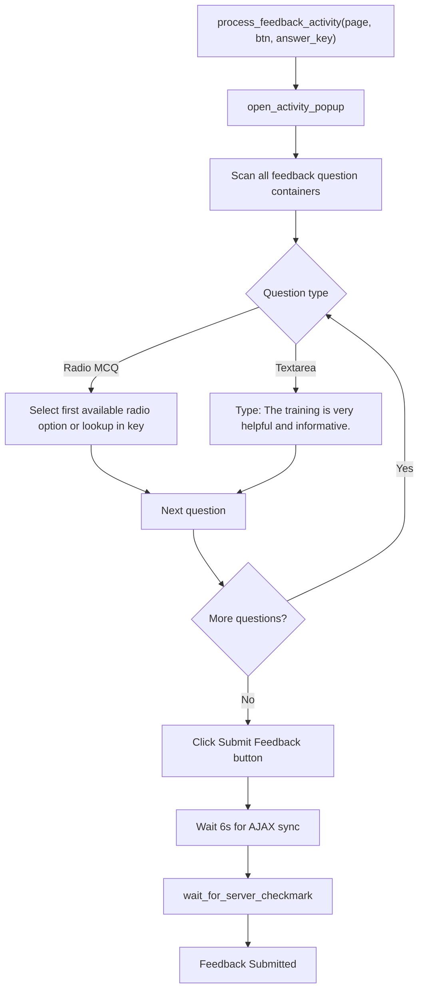

---

## 12. H5P Interactive Activity Flow

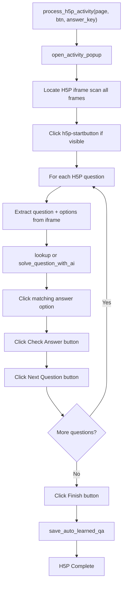

---

## 13. Locked Item Handler

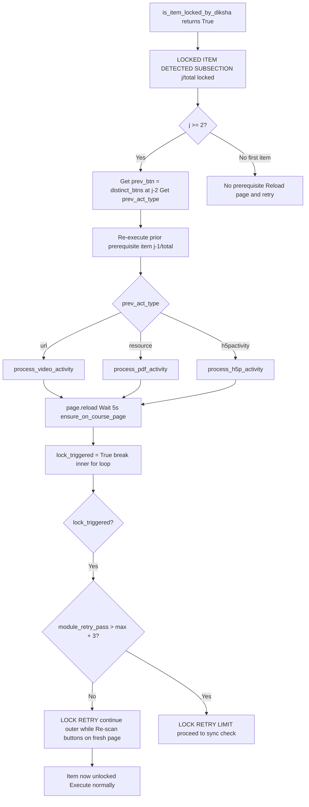

### Example Log — Locked Item
```
[12:08:22] INFO    --> [✓ ALREADY DONE] SUBSECTION [12/31]: 'Activities for Mathematical Thinking...' Skipping!
[12:08:24] WARNING   --> 🔒 [LOCKED ITEM DETECTED] SUBSECTION [13/31]: 'Play and Learning Material' locked.
[12:08:24] INFO    --> Re-triggering prior item & reloading page to hydrate DIKSHA server unlock...
[12:08:24] INFO    --> Re-executing prior prerequisite item [12/31]: 'Activities for Mathematical Thinking...'
[12:08:24] INFO  [PDF ACTIVITY] Opening PDF document resource...
[12:08:55] INFO    --> Server 100% checkmark confirmed!
[12:09:00] INFO  🔓 [LOCK RETRY] Prerequisite executed. Re-scanning 'Module 03' buttons...

===================================
 ▶ SUBSECTION [13/31]: 'Play and Learning Material' (Type: 'resource') [Attempt 1/3]
===================================
[12:09:02] INFO  [PDF ACTIVITY] Opening PDF document resource...
[12:09:35] INFO  ✅ [ATTEMPT 1/3 SUCCESS] 'Play and Learning Material' verified 100% complete!
```

---

## 14. AI Solver System

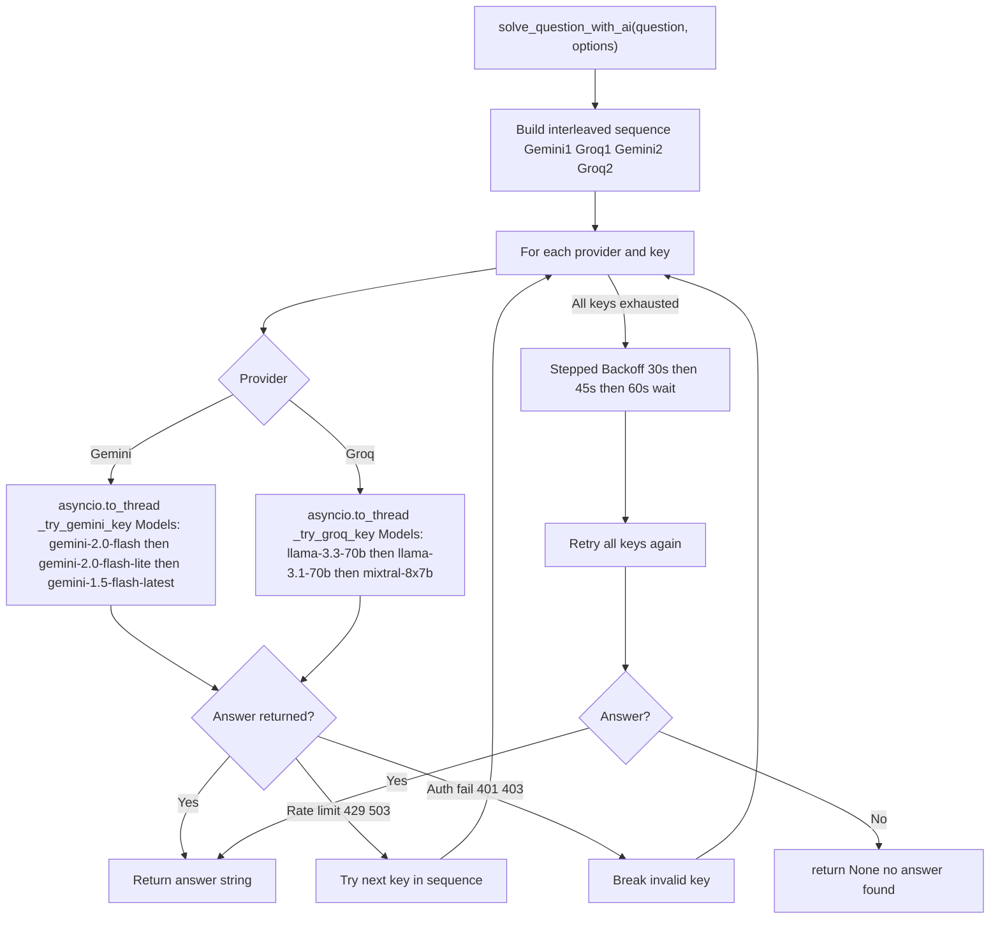

> **Important:** All HTTP calls run in `asyncio.to_thread()` — the Playwright event loop is never blocked.

### Example Log — AI Solver
```
[12:10:11] INFO    --> Querying AI solver (Gemini Key #1 → gemini-2.0-flash)...
[12:10:13] INFO    🧠 [GEMINI AI SUCCESS] Key #1 -> 'Play-based learning'
[12:10:13] INFO    --> AI Answer selected: 'Play-based learning'

--- Rate Limited Example ---
[12:10:14] WARNING   ⏳ [GEMINI RATE LIMIT] Key #1 rate limited. Trying Groq Key #1...
[12:10:14] WARNING   ⏳ [GEMINI RATE LIMIT] Key #2 rate limited. Trying Groq Key #2...
[12:10:14] INFO    ⚡ [GROQ LPU SUCCESS] Key #1 -> 'Play-based learning'

--- Backoff Example ---
[12:10:30] WARNING   ⚠️ [AI INITIAL ATTEMPTS EXHAUSTED] Entering Stepped Backoff (30s→45s→60s)...
[12:11:00] INFO    ⏳ [AI RATE LIMIT BACKOFF 1/3] Waiting 30 seconds for API quota reset...
[12:11:30] INFO    🧠 [AI BACKOFF SUCCESS] Solved on Backoff #1 (30s) via Gemini Key #2
```

---

## 15. Double Confirmation & Module Sync

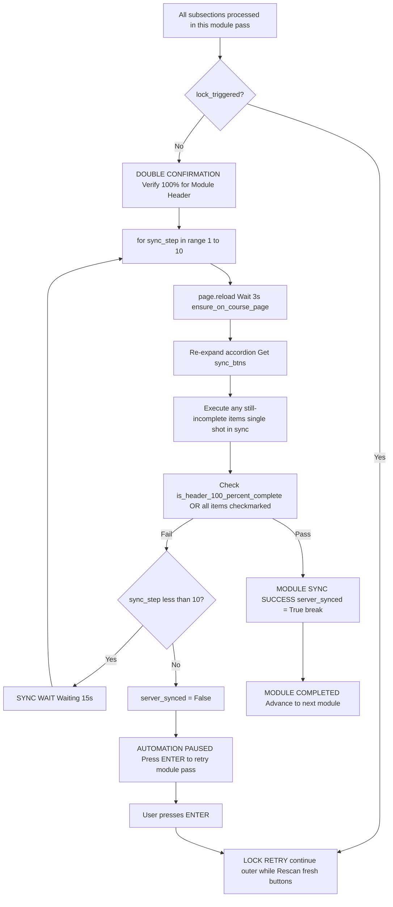

### Example Log — Module Sync Success
```
[12:09:08] INFO    --> [DOUBLE CONFIRMATION] Verifying 100% for 'Module 03: Play-based Activities...'
[12:09:10] INFO
  ⏳ [MODULE SYNC 1/10] Reloading page & re-scanning subsections...
[12:09:18] INFO    ⏳ [SYNC WAIT] Attempt 1/10 incomplete. Waiting 15s for server sync...
[12:09:33] INFO
  ⏳ [MODULE SYNC 2/10] Reloading page & re-scanning subsections...
[12:09:41] INFO  ✅ [MODULE SYNC SUCCESS] DIKSHA server completion verified on Attempt #2/10!
[12:09:41] INFO  🎓 [MODULE COMPLETED] 'Module 03: Play-based Activities' completed! Advancing...
```

### Example Log — Full Course Completion
```
===================================================================
 🎉 🎓 AUTOMATION EXECUTION SUCCESSFUL & COURSE COMPLETED!
===================================================================
  ✔ User Profile : Sumanta Halder (7044015007)
  ✔ Course Title : NISHTHA ECCE English
  ✔ Certificate  : Download Certificate Available
  ✔ Status       : 100% Complete — All Modules & Assessments Done!
===================================================================
```

---

## 16. Key Timings Reference

| Phase | Duration | Source |
|---|---|---|
| Lessons tab hydration wait | **5s** | `wait_for_timeout(5000)` |
| Popup open wait after click | **3s** | `wait_for_timeout(3000)` |
| Video warm-up buffer | **15s @ 1.0x** | Hardcoded |
| Video acceleration | **10x** (< 5min) / **16x** (≥ 5min) | Engine logic |
| Video final buffer | **45s @ 1.0x** | Hardcoded |
| PDF minimum read time | **10s** | `MIN_PDF_READ_SECONDS` |
| Feedback AJAX sync wait | **6s** | `wait_for_timeout(6000)` |
| Post-item server sync buffer | **4s** | `wait_for_timeout(4000)` |
| Per-item retry wait | **5s** | `asyncio.sleep(5)` |
| Module sync retry interval | **15s** | `asyncio.sleep(15)` |
| Module sync max attempts | **10** | `range(1, 11)` |
| Per-item retry attempts | **3** | `range(1, 4)` |
| Course restart max attempts | **5** | `range(1, 7)` |
| AI solver backoff delays | **30s → 45s → 60s** | `backoff_delays` |
| Login post-redirect wait | **10s** | `POST_LOGIN_WAIT_SECONDS` |
| Login timeout | **90s** | `timeout=90000` |

---

## Key Files

| File | Role |
|---|---|
| `main.py` | CLI entry point, PIN verification, user selection menu, asyncio.run |
| `automations/diksha_plus_engine.py` | Core automation engine 3200+ lines all async |
| `config.py` | DOM selectors, credentials, API keys, timing constants |
| `utils/security.py` | SHA-256 PIN verification, XOR password encrypt/decrypt |
| `utils/logger.py` | Timestamped colored console logger |
| `data/courses/*.json` | Per-course answer key files auto-created on first run |
| `output/screenshots/` | Auto-saved screenshots on errors |
| `diksha+.bat` | Windows launcher script |

---

*Generated: 2026-08-04 | Engine: Post-33-Bug-Fix | Fixes: 33 across 5 files*
